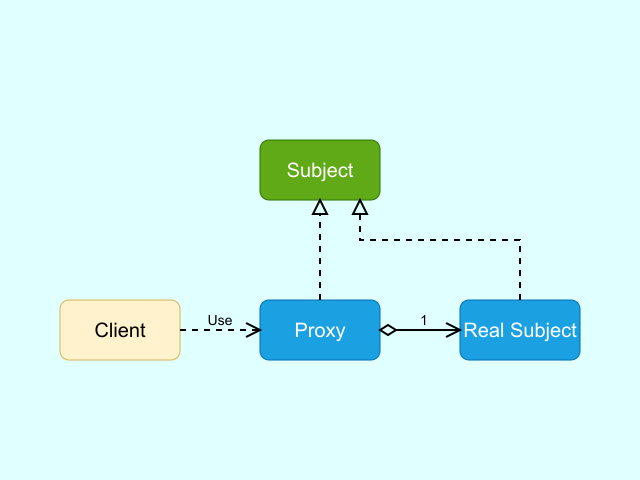

# Entwurfsmuster-Baukasten

    

Dieser Entwurfsmuster-Baukasten enthält alle 23 Entwurfsmuster aus den "Design Patterns" von Gamma et al. (GoF). Jedes Muster ist in einer strukturierten Ordnerhierarchie organisiert und enthält Klassendiagramme in PlantUML- und Draw.io-Formaten.

## Struktur

- **Erzeugungsmuster**: Muster zur Objekterstellung
  - Abstrakte Fabrik
  - Erbauer
  - Fabrikmethode
  - Prototyp
  - Singleton
- **Strukturmuster**: Muster zur Klassen- und Objektstruktur
  - Adapter
  - Brücke
  - Kompositum
  - Dekorierer
  - Fassade
  - Fliegengewicht
  - Proxy
- **Verhaltensmuster**: Muster für Objektinteraktion und Verantwortlichkeiten
  - Zuständigkeitskette
  - Befehl
  - Interpreter
  - Iterator
  - Vermittler
  - Memento
  - Beobachter
  - Zustand
  - Strategie
  - Schablonenmethode
  - Besucher

## Dateien pro Muster

- `Class_Diagram_[Muster].puml`: PlantUML-Code für das Klassendiagramm
- `Class_Diagram_[Muster].drawio`: Draw.io-Diagramm zum direkten Betrachten

## Verwendung

1. Installieren Sie die **Draw.io Integration**-Erweiterung in Ihrer Entwicklungsumgebung (z.B. VS Code).
2. Für PlantUML-Dateien (`Class_Diagram_[Muster].puml`):
   - Öffnen Sie die Datei in einem Editor mit der Draw.io Integration.
   - Drücken Sie **Alt+D**, um eine PlantUML-Vorschau des Entwurfsmuster-Diagramms zu erzeugen.
3. Für Draw.io-Dateien (`Class_Diagram_[Muster].drawio`):
   - Öffnen Sie die Datei in einem Editor mit der Draw.io Integration oder in [Draw.io](https://app.diagrams.net/).
   - Das Entwurfsmuster-Diagramm wird direkt angezeigt.
4. Nutzen Sie die Diagramme zur Analyse oder Weiterverarbeitung.

## Lizenz

Dieses Repository steht unter der [MIT-Lizenz](LICENSE).

## Beitrag

Beiträge sind willkommen! Bitte erstellen Sie einen Pull Request oder eröffnen Sie ein Issue für Vorschläge oder Fehler.